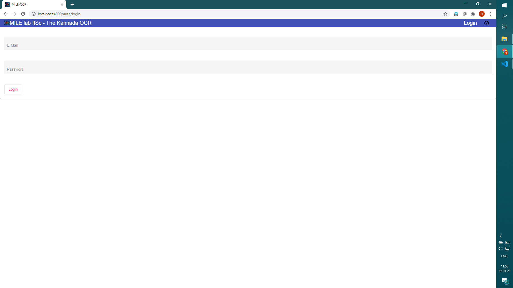
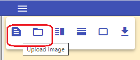
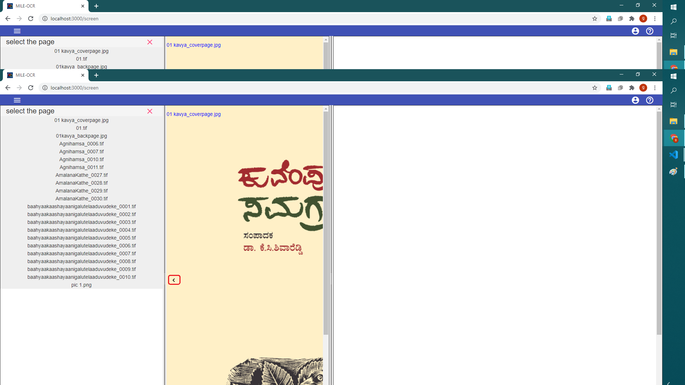
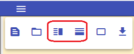

# MILE IISc - Kannada OCR Web App
## Instructions to use the OCR Web App

- Hit the MILE IISc OCR Web App URL: [OCR Web App](http://169.38.86.211:8080)
- Log in with the Email and the Password provided.

- On successful log-in, you will see the page where you can upload the scanned images. You will be able to upload a single scanned image or multiple images (with unique filename) from your local directory using the `Upload Image` and `Upload Directory` buttons respectively.

- Once the images are uploaded, you will be able to see the first image of the uploaded folder at the left side split screen.

- You can navigate to other images with the help of navigation buttons (`First Page` / `Previous Page`/ `Next Page` / `Last Page`) at the left bottom corner of the screen.

- If you want to navigate to a specific image from uploaded images folder, you can make use of `Sidebar` button to see the list of images in folder and choose the same.

- If the image is skewed during scanning, you can correct the skew using `Rotate` option in the bottom toolbar.

- You can select the text region using `Select Block` facility and which allow you to draw a rectangle over the paragraph.

- Once the blocks are selected, you can run OCR on the image by clicking the `Run-OCR` button in the bottom toolbar.

- The recognized text output will be displayed in the right side split screen and you can do text corrections on it.

- While doing corrections you can view the screen in Vertical or Horizontal mode by selecting either `Horizontal view` or `Vertical View` buttons in the top toolbar.

- You can zoom both sides of the screen by using the zoom buttons in the bottom toolbar.

- Once you have made all the corrections, you can download the corrected XML files by clicking on the `Download XML`.

