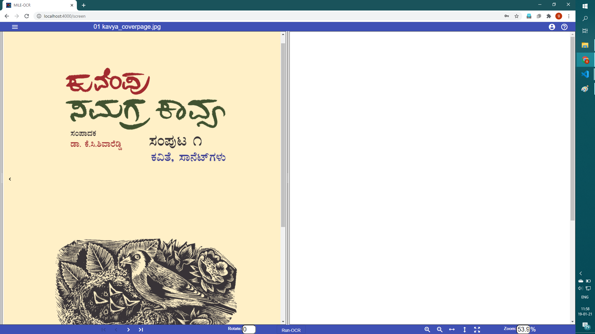
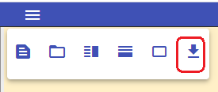

# OCR Web GUI
#### Instructions to use OCR-WEB tool

  - Hit the IISc OCR-WEB url:  [OCR-WEB](http://169.38.86.210:8080)
  - Log in with the Email and the Password provided.
  
  
  
  - On logging in, you will see the page where you can upload the scanned images. you will be able to upload a scanned single image or multiple images(with unique filename)      from your local directory using the `upload Image` and `upload folder` buttons respectively.
    
    
    
  - Once the images are uploaded, you will be able to see the first image of the uploaded folder at left side split screen in few moments.
    
    
    
  - you can navigate to other images with the help of navigation buttons(first Image/previous Image/next Image/last Image) at left bottom corner of the screen.
     
     
     
  - If you want to navigate to specific image from uploaded images folder, you can make use of `sidebar` button to see the list of images in folder and choose the same.
    
    
    
  - If the image is skewed during scanning, you can correct the skew using rotate option or enter angle for rotation in the rotate input box.
    
    
    
  - you can select the text region using select block facility and which allow you to draw a rectangle over the paragraph.
    
    
    
    
  - Run OCR for each blocks using the `Run-OCR` button.
    
    
    
  - The respective text output for the blocks selected will be displayed on the right side split screen and you can do text corrections if needed.
   
  
  
  
  - While doing corrections you can view the screen in vertical or Horizontal view by selecting either `Horizontal view` or `vertical view` buttons.
  
   
  
  - you can zoom the both sides of the screen.
    
    
    
  - you downloads the XML file generated as OCR output from `ExportXML`.
  
    
